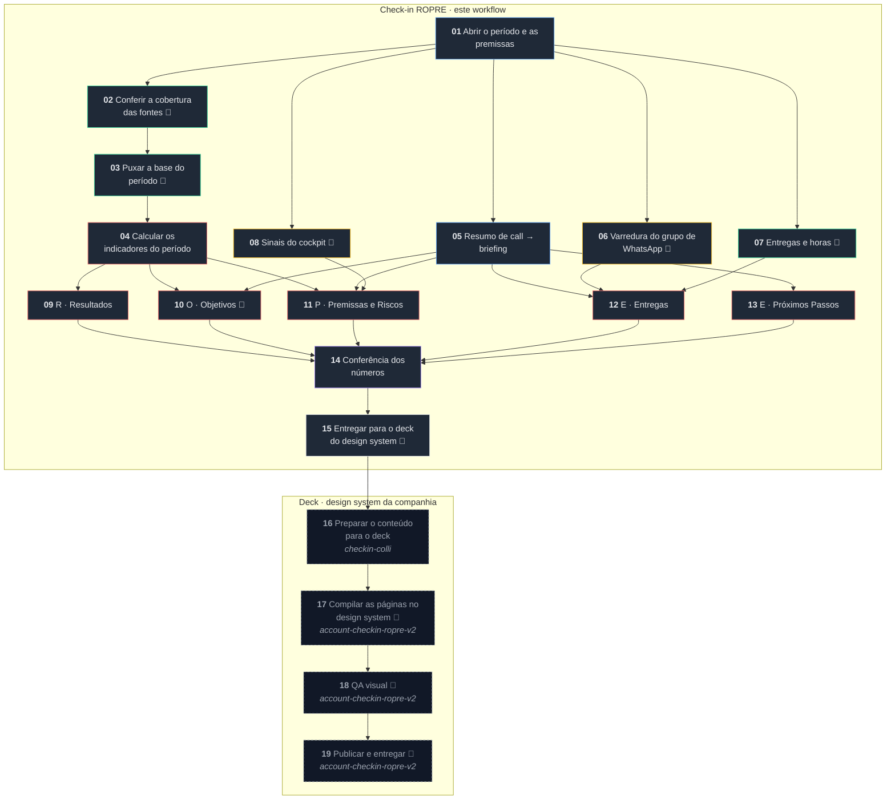

# Check-in ROPRE

**O check-in de cliente como workflow de agentes: do dado bruto ao deck da reunião, com a regra de
atribuição declarada e o que não foi medido escrito na cara.**

Toda agência responde as mesmas cinco perguntas no check-in — **R**esultados, **O**bjetivos,
**P**remissas e riscos, **E**ntregas, **E** próximos passos. Na prática, cada pessoa monta do seu
jeito: número que sai de planilha lançada à mão, ROAS calculado sobre uma base que parou de
atualizar semanas atrás, e uma reunião inteira discutindo por que a apresentação mostra mais venda
que o CRM.

Este repositório resolve isso de duas formas, e as duas usam as mesmas definições:

| | O que é | Para quê |
| --- | --- | --- |
| **O workflow** | 19 etapas encadeadas — 15 do check-in e 4 do deck — cada uma com briefing, entradas e saídas | roda dentro da plataforma de workflows, onde os dados já chegam pelo pipeline |
| **A implementação de referência** | ETL em Python, testado | confere se o workflow chegou ao número certo, e atende quem ainda não está na plataforma |

---

## O workflow

Este é o desenho. O arquivo que se importa é
[`workflow/checkin-ropre.workflow.json`](workflow/checkin-ropre.workflow.json); a especificação
completa, com o briefing de cada etapa, está em
[`referencias/workflow_v4os.md`](referencias/workflow_v4os.md). Os dois saem do mesmo JSON, então não
divergem.

<!-- diagrama:inicio -->

<!-- diagrama:fim -->

🔧 = etapa que chama ferramenta durante a execução.

O grafo tem cinco trechos, e a ordem entre eles não é estética:

1. **Fundação (01 → 02 → 03 → 04).** Primeiro o período e as premissas. Depois — e este é o ponto —
   a **cobertura das fontes**, antes de qualquer conta. Só então a base é puxada e os indicadores
   calculados. Nenhum número nasce antes de a etapa 02 dizer que a fonte cobre o período.
2. **Leitura em paralelo (05 a 08).** Call, WhatsApp, entregas e health score correm juntos, porque
   nenhum depende do outro.
3. **Os cinco blocos (09 a 13).** Cada um consome o que precisa e **nenhum recalcula nada**.
4. **Conferência e entrega (14 → 15).** A conferência reconta direto da base e bloqueia se não bater.
   A 15 é o handoff: o check-in aprovado sai daqui.
5. **Deck (16 a 19), em outra skill.** `checkin-colli` organiza o conteúdo na narrativa de slides;
   `account-checkin-ropre-v2` compila as páginas no design system (HTML 1600×900, tokens, layouts),
   roda o QA visual e publica. No diagrama esse trecho aparece pontilhado: é o mesmo fluxo, com outro
   dono.

O que o check-in cobra dessa última etapa vale como contrato, e está escrito no briefing de cada
uma: número não se recalcula na diagramação, "não medido" não vira travessão nem some por falta de
espaço, e o QA visual confere também **conteúdo** — todo número do deck existe no check-in aprovado.

<!-- etapas:inicio -->
| # | Etapa | Categoria | Executada por | Leis | Chama ferramenta |
| --- | --- | --- | --- | --- | --- |
| 01 | Abrir o período e as premissas | Briefing | este workflow | 2 | — |
| 02 | Conferir a cobertura das fontes | Dados | este workflow | 1 | sim |
| 03 | Puxar a base do período | Dados | este workflow | 1, 2 | sim |
| 04 | Calcular os indicadores do período | Análise | este workflow | 1, 2, 3 | — |
| 05 | Resumo de call → briefing | Briefing | este workflow · catálogo `Resumo de call → briefing` | — | — |
| 06 | Varredura do grupo de WhatsApp | Pesquisa | este workflow | — | sim |
| 07 | Entregas e horas | Dados | este workflow | 3 | sim |
| 08 | Sinais do cockpit | Pesquisa | este workflow | — | sim |
| 09 | R · Resultados | Análise | este workflow | 2, 3, 4 | — |
| 10 | O · Objetivos | Análise | este workflow | 3, 4 | sim |
| 11 | P · Premissas e Riscos | Análise | este workflow | 3, 4 | — |
| 12 | E · Entregas | Análise | este workflow | 3, 4 | — |
| 13 | E · Próximos Passos | Análise | este workflow | 4 | — |
| 14 | Conferência dos números | Revisão | este workflow | 1, 2, 3, 4 | — |
| 15 | Entregar para o deck do design system | Entrega | este workflow | 3, 4 | sim |
| 16 | Preparar o conteúdo para o deck | Entrega | `checkin-colli` | 3, 4 | — |
| 17 | Compilar as páginas no design system | Entrega | `account-checkin-ropre-v2` | 4 | sim |
| 18 | QA visual | Revisão | `account-checkin-ropre-v2` | 3, 4 | sim |
| 19 | Publicar e entregar | Entrega | `account-checkin-ropre-v2` | 4 | sim |
<!-- etapas:fim -->

### As leis que viajam em cada briefing

Com o cálculo acontecendo em etapa de modelo, regra escrita uma vez no topo não serve: ela precisa
estar dentro da tarefa. Estas entram no briefing de toda etapa que toca número.

<!-- leis:inicio -->
1. **Cobertura antes de conta.** Nenhum indicador que dependa de uma fonte é calculado antes de a etapa 02 dizer que aquela fonte cobre o período inteiro. Fonte incompleta → o indicador sai **"não medido"**, com o motivo e o último dia com dado.
2. **Definição é fixa, não é escolha.** Faturamento lê **data de fechamento**. Safra lê **data de criação**. Recorrente é o **funil de recorrência**, não o campo de venda base. Atribuição é a **regra declarada no projeto**, e ela aparece escrita no deck.
3. **Lacuna é resposta.** Nunca preencher buraco com média, proporção, estimativa ou "mês anterior". Não medir e dar zero são coisas diferentes, e as duas são diferentes de "estável".
4. **Número novo não nasce na escrita.** Todo valor citado nos blocos tem de existir na saída da etapa de cálculo. Quem escreve o bloco não recalcula nada.
<!-- leis:fim -->

### Por que a etapa 02 existe

Na primeira execução real, o check-in devolveu **ROAS de 37 e taxa de entrada no CRM de 720%**. Os
dois números estavam aritmeticamente corretos: a base de um dos canais de mídia tinha parado de
atualizar semanas antes, então o mês ficou com a receita inteira e só uma fração do investimento.

Modelo nenhum pega isso lendo o resultado — o número parece ótimo. Pega-se **antes**, conferindo até
que dia cada fonte tem dado. Daí a etapa de cobertura vir antes do cálculo, e o indicador que depende
de fonte furada sair como "não medido", com o motivo e o último dia com dado.

### Como levar para o V4OS

O JSON deste repositório é a **especificação neutra** do workflow, não o export do Studio. Quem
constrói lá dentro — o harness ou uma pessoa — cria uma etapa por item de `etapas` e uma conexão por
item de `conexoes`, assim:

<!-- import:inicio -->
1. Declare `entradas_do_workflow` como o formulário do workflow. A etapa 01 as consome; nada é perguntado ao usuário depois.
2. O briefing de cada etapa é `briefing` **precedido do texto das leis** listadas em `leis_aplicaveis` (índices em `leis`, a partir de 1). Regra escrita fora do briefing não chega ao agente que executa a etapa.
3. Para cada etapa com `chama_ferramenta`, ligue as ferramentas de `ferramentas` (servidor e nome). Os `cuidados` de cada ferramenta entram no briefing da etapa — são as pegadinhas que já custaram número errado.
4. Etapa com `origem: catalogo` usa o template do catálogo em `etapa_do_catalogo`; o `briefing` é o complemento ao template.
5. Etapa com `origem: outra_skill` não é criada aqui: é a etapa correspondente da skill em `executado_por`, e o `briefing` é o contrato que o check-in cobra dela.
6. Ligue as `conexoes` (de → para). Etapas com o mesmo antecessor correm em paralelo.
7. Antes de publicar, rode num período já fechado e compare com a implementação de referência, número a número (seção *Como validar*).
<!-- import:fim -->

**As entradas do workflow.** O que se preenche para rodar. A regra de atribuição, os funis, a margem
e o fee não moram em sistema nenhum da plataforma, por isso entram como input, e não como pergunta
no meio do caminho.

<!-- entradas:inicio -->
| Entrada | Tipo | Obrigatória | O que é |
| --- | --- | --- | --- |
| `projeto` | texto | sim | o projectDocumentId do projeto na plataforma, ou o nome do cliente — a etapa 01 resolve o id com localize_project (BigQuery de calls) ou cockpit_list_projects. Um cliente pode ter mais de um projeto (assessoria e produto adicional são contratos separados); cada projeto é um check-in. |
| `cadencia` | `quinzenal` · `mensal` · `quarter` | sim | define o corte do período e a profundidade dos blocos (ver referencias/ropre.md). |
| `referencia` | data YYYY-MM-DD | sim | qualquer dia dentro do período; a etapa 01 resolve início e fim, e marca como parcial se o período ainda não terminou. |
| `premissas_do_projeto` | objeto | sim | o que não mora em sistema nenhum da plataforma e por isso entra como input: fee, verba de mídia bruta e imposto, margem de contribuição (com origem e data), funis de venda, funil de recorrência, a regra de atribuição (tags, origens da agência, origens de mídia paga, origens em aberto, e a data em que foi fechada), os OKRs do ciclo (kr, métrica, meta, comparador), os riscos cadastrados (causa, risco, efeito, probabilidade, impacto) e, se o cliente lança à mão, o lançamento manual por mês. Molde: clientes/exemplo/cliente.json. |
| `fonte_por_canal` | objeto | não | dono de cada canal de mídia quando o mesmo canal existe em duas fontes (ex.: meta na plataforma, google numa planilha porque a conexão quebrou). Sem isso, tudo vem da plataforma e nada é contado duas vezes. |
| `grupo_de_whatsapp` | texto | não | id do grupo do cliente no BigQuery de WhatsApp. Sem ele, a etapa 06 diz que não há grupo ligado. |
| `entregas_do_periodo` | objeto | não | realizadas (com evidência), previstas (com dono e prazo) e horas, enquanto a fonte de entregas (ekyte) não estiver ligada. Molde: clientes/exemplo/entradas/entregas.json. |
<!-- entradas:fim -->

**As ferramentas, por etapa.** Cada etapa marcada 🔧 diz no JSON qual servidor e qual ferramenta
chama, com os parâmetros e os cuidados que já custaram número errado — o `endLt` exclusivo, a
paginação de 100 sem metadado, o `account_id` sem `act_`, o `granularity: monthly`. Esses cuidados
entram no briefing da etapa. A tabela resume; a
[especificação](referencias/workflow_v4os.md) traz parâmetros e cuidados por extenso.

<!-- ferramentas:inicio -->
| Etapa | Servidor | Ferramenta | Para quê |
| --- | --- | --- | --- |
| 02 | **dados-flow** | `flow_project_data_list_connections` | lista as conexões do projeto com categoria, plataforma, accountId, active, queryable, lastRunAt e lastRunStatus — é o estado de cada fonte |
| 02 | **dados-flow** | `flow_media_query` | último dia com custo por canal: `SELECT MAX(date_start) FROM <tabela de insights> WHERE account_id = '<id>'` |
| 02 | **dados-flow** | `flow_crm_query` | último negócio criado e atualizado, quando o CRM do projeto está na plataforma |
| 03 | **dados-flow** | `flow_media_list_tables` | descobre a tabela de insights da conexão — o nome muda por conta e por plataforma |
| 03 | **dados-flow** | `flow_media_query` | custo, impressões e cliques por dia, numa chamada só e exata |
| 03 | **dados-flow** | `flow_media_conversion_summary` | leads por dia — desempacota as ações (`lead` ou `onsite_conversion.lead_grouped`) |
| 03 | **dados-flow** | `flow_crm_list_tables + flow_crm_query` | negócios (id, criação, fechamento, status, valor, funil, etapa, motivo de perda, contato, tags, origem) e contatos (id, criação, origem, canal), quando o CRM está na plataforma |
| 05 | **bigquery-calls** | `consultar_calls_por_tipo` | as calls do projeto no período, com trecho de transcrição |
| 05 | **bigquery-calls** | `localize_project` | acha o projectDocumentId pelo nome do cliente |
| 06 | **bigquery-whatsapp** | `whatsapp_resumir_grupos_queryon` | resumo do grupo no período: `latest_resumo`, `latest_status_risco`, `last_created_at` |
| 07 | **ekyte** | a confirmar | entregas realizadas, previstas e horas do projeto |
| 08 | **cockpit** | `cockpit_list_projects` | cadastro do projeto (filtro por `filtersJson`): datas, status, contrato |
| 10 | **dados-flow** | `flow_goals_list` | metas cadastradas do período, com `target`, `actual`, `attainment` e `pace` |
| 15 | **plataforma** | a confirmar | entregar o pacote aprovado à etapa 16 (`checkin-colli`) e gravar o documento de revisão |
<!-- ferramentas:fim -->

**O que só quem está dentro da plataforma responde.** O repositório vai até onde dá para ir de fora.
Estes pontos ficaram declarados no JSON como pendência, e cada um tem um fallback escrito na etapa:

<!-- pendencias:inicio -->
| O que falta | Por quê | Quem responde |
| --- | --- | --- |
| schema de export do Studio | para o mapeamento deste JSON ser mecânico em vez de manual | V4OS |
| catálogo completo de etapas | 06, 07 e 08 podem ter template pronto; só `Resumo de call → briefing` foi reusada | V4OS |
| como uma etapa declara a ferramenta MCP que chama | vale para toda etapa marcada 🔧 | V4OS |
| como uma etapa aciona outra skill | é a passagem 15 → 16 | V4OS |
| contrato de entrada de `checkin-colli` e de `account-checkin-ropre-v2` | até saber o formato que elas esperam, o check-in entrega no de referencias/checkin.exemplo.json | dono das skills |
| servidor e credencial do ekyte | a etapa 07 está sem fonte; enquanto isso, entregas entram pela entrada `entregas_do_periodo` | V4OS |
| ferramentas de health score, NPS e churn do cockpit | etapa 08; só `cockpit_list_projects` é conhecida | V4OS |
| onde as calls do projeto ficam registradas | `consultar_calls_por_tipo` voltou vazio no primeiro cliente | V4OS |
| produto do workflow | cabeçalho está como *a confirmar* | quem publica |
<!-- pendencias:fim -->

---

## De onde vêm os dados

O check-in não fala com ferramenta de cliente uma a uma. Ele consome a **plataforma de dados da
companhia** (o Flow), que já concentra tudo, e onde um **pipeline de ingestão** (o Nekt) sincroniza
as contas de cada projeto para um data warehouse. Isso muda o que o check-in precisa saber: em vez de
uma integração por cliente, existe **um identificador de projeto** e, a partir dele, a plataforma
resolve qual conta, qual tabela e qual fonte responder.

O acesso é por servidores MCP, um por domínio. Nenhum endereço ou credencial mora neste repositório.

| Servidor | O que responde | Onde entra no check-in |
| --- | --- | --- |
| **dados-flow** | tudo que o pipeline sincroniza do projeto: CRM, mídia paga, analytics, e-commerce, operações, social orgânico e as **metas** do período | blocos R e O |
| **cockpit** | cadastro do projeto, health score e seu histórico, entradas e saídas (churn, aviso prévio, renovação), expansão, NPS e simulações de break-even | blocos O e P |
| **BigQuery de calls** | as calls do projeto no período, com transcrição | bloco O e Próximos Passos |
| **BigQuery de WhatsApp** | os grupos do cliente, atividade por dia e mensagens | bloco de Entregas (pendências) |
| **catálogo de produtos** | os SKUs que a companhia vende | contexto de expansão |

O que o pipeline entrega dentro do **dados-flow**, por domínio:

| Domínio | Plataformas típicas | O que o check-in usa |
| --- | --- | --- |
| **CRM** | RD Station, HubSpot, Pipedrive, PipeRun, Kommo, Salesforce | negócios (criação, fechamento, status, valor, funil, etapa, motivo de perda), contatos e as marcas de atribuição — é daqui que sai faturamento, novo contra recorrente, safra e taxa de ganho |
| **Mídia paga** | Google Ads, Meta Ads, LinkedIn Ads, TikTok Ads | investimento, impressões, cliques e leads por dia, campanha, conjunto, anúncio e criativo — daqui saem ROAS, CPL, CTR, CAC e a eficiência por safra |
| **Analytics** | GA4, Search Console | sessões, eventos e conversões, para cruzar comportamento na página com o que entrou no CRM |
| **E-commerce** | Shopify, VTEX, WooCommerce | pedidos e receita, quando o modelo do cliente é e-commerce em vez de inside sales |
| **Operações** | Zendesk, Monday | chamados e tarefas, quando o projeto tem operação conectada |
| **Social orgânico** | Instagram, Facebook Pages | alcance e engajamento do que não é pago |

Duas coisas que a plataforma responde e que valem tanto quanto os números: **quais conexões o projeto
tem e o estado de cada uma** (quando rodou pela última vez e se foi com sucesso) — é o insumo da
etapa de cobertura — e **as metas cadastradas do período**, com atingimento e ritmo, que alimentam o
bloco de Objetivos em vez de alguém digitar OKR à mão.

Quando uma fonte não está na plataforma, entra um adaptador próprio: é o caso de um CRM ainda não
conectado, ou de um canal de mídia cuja conexão quebrou e cujo dado só existe na planilha de
acompanhamento. Por isso `fonte_por_canal` no `cliente.json`: cada canal tem um dono declarado, e o
mesmo canal nunca é contado duas vezes.

---

## A implementação de referência

Mesmo desenho, em Python, para conferir número e para rodar fora da plataforma. É uma skill do
[Claude Code](https://claude.com/claude-code) e funciona sozinha no terminal: Python puro, com
`python-pptx` só na hora de gerar o deck.

### O que o ETL faz

**Extrair** é normalizar fontes que não se parecem. O CRM devolve oportunidade com nome de funil e
data em UTC; a mídia devolve linha por anúncio e por dia; o WhatsApp devolve conversa; a call devolve
transcrição. Cada adaptador traduz a sua fonte para **um único formato**, o modelo canônico, onde
data é sempre dia local em ISO, dinheiro é sempre float em reais, e **todo negócio e todo contato
chegam com a atribuição já resolvida** — se é da agência e por qual marca (tag, origem, mídia paga).
O que a fonte não tem vira `None` e um aviso, nunca zero.

**Transformar** é onde moram as decisões que costumam ser tomadas no improviso. Antes de qualquer
conta, mede-se a **cobertura**: até que dia cada fonte tem dado no período, com tolerância de um dia
porque plataforma de anúncio consolida em D-1. Só então vêm os números — vendas e receita por data de
fechamento, novo contra recorrente, ticket, investimento, ROAS, CPL, CTR, CAC, taxa de entrada no
CRM, break-even proporcional aos dias, resultado do período, safra por mês de criação com taxa de
ganho e maturidade, motivos de perda, distribuição de ticket, cobertura de atribuição e a ponte com o
que o cliente lança na planilha dele. Cada um desses sai `null` quando a fonte que ele depende não
cobriu o período.

**Carregar** é montar os cinco blocos do ROPRE a partir disso e renderizar duas saídas do mesmo
pacote: o deck da reunião e o documento de revisão. Como as duas nascem do mesmo `checkin.json`, não
existe versão com número diferente.

```
extrair/       E — um adaptador por fonte, todos devolvem o mesmo formato
  flow_mcp.py          plataforma de dados via MCP: mídia por dia e canal, metas,
                       WhatsApp e calls, com descoberta das conexões do projeto
  crm_nectarcrm.py     CRM direto, para quem ainda não está na plataforma
  midia_planilha.py    mídia paga em planilha diária, para canal com conexão quebrada
  conversas_mcp.py     calls e WhatsApp já lidos, gravados para conferência humana
transformar/   T — o contrato e as contas
  canonico.py          modelo canônico, períodos (quinzena, mês, quarter) e validação
  metricas.py          cobertura, vendas, funil, mídia, break-even, safra, atribuição
carregar/      L — os cinco blocos e os dois renderizadores
  blocos.py            monta o checkin.json
  documento.py         markdown para revisar antes da reunião
  deck.py              .pptx na ordem do template
clientes/<cliente>/    cliente.json, extrato e entradas do período (fora do git)
tests/regressao.py     as regras que não podem quebrar
```

O contrato entre as camadas é `transformar/canonico.py`. Enquanto o adaptador devolver o canônico,
trocar de CRM ou de origem dos dados não encosta no check-in — foi assim que a mídia migrou da
planilha para a plataforma sem uma linha de mudança no cálculo nem no deck.

```bash
./gerar.sh exemplo mensal 2026-08-15       # mês fechado
./gerar.sh exemplo quinzenal 2026-09-21    # quinzena corrente, sai marcada como parcial
python3 tests/regressao.py
python3 workflow/render_spec.py            # regenera documentação e diagrama a partir do JSON
```

Saída em `saida/<cliente>/`: `checkin.json` (os números, para conferir), `checkin.md` (documento de
revisão) e `checkin.pptx` (deck).

---

## O deck e o design system

Este repositório produz **conteúdo com número defensável**. Diagramação, identidade visual e QA
visual são de outra casa: dentro da plataforma, o deck é renderizado pela skill de design system da
companhia (`account-checkin-ropre-v2`), que já tem os tokens, os layouts de 1600×900, o storytelling
de performance e a conferência visual. A etapa 15 do workflow **entrega o check-in aprovado para
ela** em vez de desenhar slide.

| Skill | Papel | Relação com este workflow |
| --- | --- | --- |
| `account-checkin-ropre-v2` | renderiza o deck no design system | recebe o check-in aprovado da etapa 15, pela 16 |
| `checkin-colli` | prepara o conteúdo antes do deck | sobrepõe em parte os blocos 09 a 13; a divisão precisa ser confirmada |
| `design-system-pro` | criar ou refazer o design system no Figma | fora do escopo do check-in |

O que a etapa 15 entrega tem forma conhecida: é o `checkin.json` da implementação de referência, e um
exemplo real dele — gerado de dado sintético, sem cliente — está em
[`referencias/checkin.exemplo.json`](referencias/checkin.exemplo.json). Até as duas skills dizerem
que formato esperam, é esse o contrato.

Duas coisas não podem ser podadas pela diagramação, e isso vale como requisito para qualquer layout:
a **regra de atribuição escrita por extenso** no bloco de Resultados, e a página final de **fontes e
o que não foi medido**. São elas que sustentam o número quando alguém pergunta de onde ele veio.

O renderizador `.pptx` deste repositório continua existindo como **fallback para fora da
plataforma** — onde não há design system, ele entrega a mesma sequência de blocos.

---

## As definições, e por que cada uma

| Definição | Por quê |
| --- | --- |
| Faturamento lê **data de fechamento** | é o que o cliente reconhece como resultado do mês |
| Safra lê **data de criação** | é a leitura que isola o efeito da mídia daquele mês |
| Recorrente é o **funil de recorrência** | o campo de "venda base" do CRM costuma vir vazio ou errado |
| Novo e recorrente **separados e somados** | a planilha do cliente lança só a venda nova, e a recompra some do total |
| Atribuição **declarada no `cliente.json`** | número sem regra escrita não se defende numa reunião |
| Fonte incompleta vira **"não medido"** | evita ROAS inflado por base parada |
| Período parcial é **marcado**, meta é **proporcional** | quinzena não se compara com meta mensal |
| Um canal tem **um dono** (`fonte_por_canal`) | o mesmo canal em duas fontes dobra o investimento |

## Configurar um cliente

Copie `clientes/exemplo/cliente.json` e ajuste: fee, verba, margem, funis de venda e de recorrência,
a regra de atribuição, os OKRs do ciclo e os riscos conhecidos. Para ligar a plataforma de dados,
preencha o bloco `flow` com o `project_document_id` — o topo de `extrair/flow_mcp.py` explica como
achar o projeto e onde ficam as credenciais, que nunca entram no repositório.

A pasta de cada cliente fica fora do git por padrão. Quem opera um cliente real mantém também a sua
própria regressão em `tests/regressao_cliente.py`, com um mês já fechado e os números conferidos à
mão — é o que garante que uma mudança na skill não mova silenciosamente o resultado de ninguém.

## Testes

```bash
python3 tests/regressao.py
```

Trava leitura de data, atribuição, novo contra recorrente, corte de quinzena, mídia incompleta,
comparadores de OKR, pendências de call e WhatsApp e os dois renderizadores.

## Licença

MIT.
