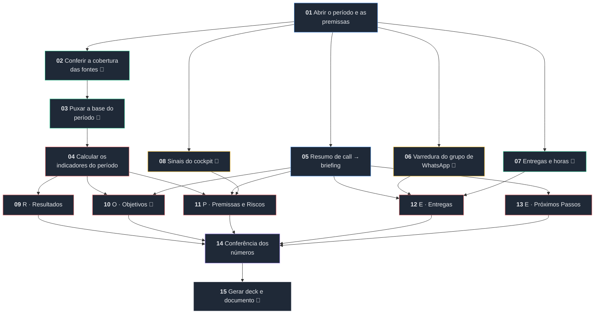

# Check-in ROPRE

**O check-in de cliente como workflow de agentes: do dado bruto ao deck da reunião, com a regra de
atribuição declarada e o que não foi medido escrito na cara.**

Toda agência responde as mesmas cinco perguntas no check-in — **R**esultados, **O**bjetivos,
**P**remissas e riscos, **E**ntregas, **E** próximos passos. Na prática, cada pessoa monta do seu
jeito: número que sai de planilha lançada à mão, ROAS calculado sobre uma base que parou de
atualizar semanas atrás, e uma reunião inteira discutindo por que a apresentação mostra mais venda
que o CRM.

Este repositório resolve isso de duas formas, e as duas usam as mesmas definições:

| | O que é | Para quê |
| --- | --- | --- |
| **O workflow** | 15 etapas encadeadas, cada uma com briefing, entradas e saídas | roda dentro da plataforma de workflows, onde os dados já chegam pelo pipeline |
| **A implementação de referência** | ETL em Python, testado | confere se o workflow chegou ao número certo, e atende quem ainda não está na plataforma |

---

## O workflow

Este é o desenho. O arquivo que se importa é
[`workflow/checkin-ropre.workflow.json`](workflow/checkin-ropre.workflow.json); a especificação
completa, com o briefing de cada etapa, está em
[`referencias/workflow_v4s.md`](referencias/workflow_v4s.md). Os dois saem do mesmo JSON, então não
divergem.

<!-- diagrama:inicio -->

<!-- diagrama:fim -->

🔧 = etapa que chama ferramenta durante a execução.

O grafo tem quatro trechos, e a ordem entre eles não é estética:

1. **Fundação (01 → 02 → 03 → 04).** Primeiro o período e as premissas. Depois — e este é o ponto —
   a **cobertura das fontes**, antes de qualquer conta. Só então a base é puxada e os indicadores
   calculados. Nenhum número nasce antes de a etapa 02 dizer que a fonte cobre o período.
2. **Leitura em paralelo (05 a 08).** Call, WhatsApp, entregas e health score correm juntos, porque
   nenhum depende do outro.
3. **Os cinco blocos (09 a 13).** Cada um consome o que precisa e **nenhum recalcula nada**.
4. **Fechamento (14 → 15).** A conferência reconta direto da base e bloqueia se não bater; só depois
   saem o deck e o documento.

<!-- etapas:inicio -->
| # | Etapa | Categoria | Origem | Chama ferramenta |
| --- | --- | --- | --- | --- |
| 01 | Abrir o período e as premissas | Briefing | do zero | — |
| 02 | Conferir a cobertura das fontes | Dados | do zero | sim |
| 03 | Puxar a base do período | Dados | do zero | sim |
| 04 | Calcular os indicadores do período | Análise | do zero | — |
| 05 | Resumo de call → briefing | Briefing | catálogo · `Resumo de call → briefing` | — |
| 06 | Varredura do grupo de WhatsApp | Pesquisa | do zero | sim |
| 07 | Entregas e horas | Dados | do zero | sim |
| 08 | Sinais do cockpit | Pesquisa | do zero | sim |
| 09 | R · Resultados | Análise | do zero | — |
| 10 | O · Objetivos | Análise | do zero | sim |
| 11 | P · Premissas e Riscos | Análise | do zero | — |
| 12 | E · Entregas | Análise | do zero | — |
| 13 | E · Próximos Passos | Análise | do zero | — |
| 14 | Conferência dos números | Revisão | do zero | — |
| 15 | Gerar deck e documento | Entrega | do zero | sim |
<!-- etapas:fim -->

### As leis que viajam em cada briefing

Com o cálculo acontecendo em etapa de modelo, regra escrita uma vez no topo não serve: ela precisa
estar dentro da tarefa. Estas entram no briefing de toda etapa que toca número.

<!-- leis:inicio -->
1. **Cobertura antes de conta.** Nenhum indicador que dependa de uma fonte é calculado antes de a etapa 02 dizer que aquela fonte cobre o período inteiro. Fonte incompleta → o indicador sai **"não medido"**, com o motivo e o último dia com dado.
2. **Definição é fixa, não é escolha.** Faturamento lê **data de fechamento**. Safra lê **data de criação**. Recorrente é o **funil de recorrência**, não o campo de venda base. Atribuição é a **regra declarada no projeto**, e ela aparece escrita no deck.
3. **Lacuna é resposta.** Nunca preencher buraco com média, proporção, estimativa ou "mês anterior". Não medir e dar zero são coisas diferentes, e as duas são diferentes de "estável".
4. **Número novo não nasce na escrita.** Todo valor citado nos blocos tem de existir na saída da etapa de cálculo. Quem escreve o bloco não recalcula nada.
<!-- leis:fim -->

### Por que a etapa 02 existe

Na primeira execução real, o check-in devolveu **ROAS de 37 e taxa de entrada no CRM de 720%**. Os
dois números estavam aritmeticamente corretos: a base de um dos canais de mídia tinha parado de
atualizar semanas antes, então o mês ficou com a receita inteira e só uma fração do investimento.

Modelo nenhum pega isso lendo o resultado — o número parece ótimo. Pega-se **antes**, conferindo até
que dia cada fonte tem dado. Daí a etapa de cobertura vir antes do cálculo, e o indicador que depende
de fonte furada sair como "não medido", com o motivo e o último dia com dado.

---

## De onde vêm os dados

O check-in não fala com ferramenta de cliente uma a uma. Ele consome a **plataforma de dados da
companhia** (o Flow), que já concentra tudo, e onde um **pipeline de ingestão** (o Nekt) sincroniza
as contas de cada projeto para um data warehouse. Isso muda o que o check-in precisa saber: em vez de
uma integração por cliente, existe **um identificador de projeto** e, a partir dele, a plataforma
resolve qual conta, qual tabela e qual fonte responder.

O acesso é por servidores MCP, um por domínio. Nenhum endereço ou credencial mora neste repositório.

| Servidor | O que responde | Onde entra no check-in |
| --- | --- | --- |
| **dados-flow** | tudo que o pipeline sincroniza do projeto: CRM, mídia paga, analytics, e-commerce, operações, social orgânico e as **metas** do período | blocos R e O |
| **cockpit** | cadastro do projeto, health score e seu histórico, entradas e saídas (churn, aviso prévio, renovação), expansão, NPS e simulações de break-even | blocos O e P |
| **BigQuery de calls** | as calls do projeto no período, com transcrição | bloco O e Próximos Passos |
| **BigQuery de WhatsApp** | os grupos do cliente, atividade por dia e mensagens | bloco de Entregas (pendências) |
| **catálogo de produtos** | os SKUs que a companhia vende | contexto de expansão |

O que o pipeline entrega dentro do **dados-flow**, por domínio:

| Domínio | Plataformas típicas | O que o check-in usa |
| --- | --- | --- |
| **CRM** | RD Station, HubSpot, Pipedrive, PipeRun, Kommo, Salesforce | negócios (criação, fechamento, status, valor, funil, etapa, motivo de perda), contatos e as marcas de atribuição — é daqui que sai faturamento, novo contra recorrente, safra e taxa de ganho |
| **Mídia paga** | Google Ads, Meta Ads, LinkedIn Ads, TikTok Ads | investimento, impressões, cliques e leads por dia, campanha, conjunto, anúncio e criativo — daqui saem ROAS, CPL, CTR, CAC e a eficiência por safra |
| **Analytics** | GA4, Search Console | sessões, eventos e conversões, para cruzar comportamento na página com o que entrou no CRM |
| **E-commerce** | Shopify, VTEX, WooCommerce | pedidos e receita, quando o modelo do cliente é e-commerce em vez de inside sales |
| **Operações** | Zendesk, Monday | chamados e tarefas, quando o projeto tem operação conectada |
| **Social orgânico** | Instagram, Facebook Pages | alcance e engajamento do que não é pago |

Duas coisas que a plataforma responde e que valem tanto quanto os números: **quais conexões o projeto
tem e o estado de cada uma** (quando rodou pela última vez e se foi com sucesso) — é o insumo da
etapa de cobertura — e **as metas cadastradas do período**, com atingimento e ritmo, que alimentam o
bloco de Objetivos em vez de alguém digitar OKR à mão.

Quando uma fonte não está na plataforma, entra um adaptador próprio: é o caso de um CRM ainda não
conectado, ou de um canal de mídia cuja conexão quebrou e cujo dado só existe na planilha de
acompanhamento. Por isso `fonte_por_canal` no `cliente.json`: cada canal tem um dono declarado, e o
mesmo canal nunca é contado duas vezes.

---

## A implementação de referência

Mesmo desenho, em Python, para conferir número e para rodar fora da plataforma. É uma skill do
[Claude Code](https://claude.com/claude-code) e funciona sozinha no terminal: Python puro, com
`python-pptx` só na hora de gerar o deck.

### O que o ETL faz

**Extrair** é normalizar fontes que não se parecem. O CRM devolve oportunidade com nome de funil e
data em UTC; a mídia devolve linha por anúncio e por dia; o WhatsApp devolve conversa; a call devolve
transcrição. Cada adaptador traduz a sua fonte para **um único formato**, o modelo canônico, onde
data é sempre dia local em ISO, dinheiro é sempre float em reais, e **todo negócio e todo contato
chegam com a atribuição já resolvida** — se é da agência e por qual marca (tag, origem, mídia paga).
O que a fonte não tem vira `None` e um aviso, nunca zero.

**Transformar** é onde moram as decisões que costumam ser tomadas no improviso. Antes de qualquer
conta, mede-se a **cobertura**: até que dia cada fonte tem dado no período, com tolerância de um dia
porque plataforma de anúncio consolida em D-1. Só então vêm os números — vendas e receita por data de
fechamento, novo contra recorrente, ticket, investimento, ROAS, CPL, CTR, CAC, taxa de entrada no
CRM, break-even proporcional aos dias, resultado do período, safra por mês de criação com taxa de
ganho e maturidade, motivos de perda, distribuição de ticket, cobertura de atribuição e a ponte com o
que o cliente lança na planilha dele. Cada um desses sai `null` quando a fonte que ele depende não
cobriu o período.

**Carregar** é montar os cinco blocos do ROPRE a partir disso e renderizar duas saídas do mesmo
pacote: o deck da reunião e o documento de revisão. Como as duas nascem do mesmo `checkin.json`, não
existe versão com número diferente.

```
extrair/       E — um adaptador por fonte, todos devolvem o mesmo formato
  flow_mcp.py          plataforma de dados via MCP: mídia por dia e canal, metas,
                       WhatsApp e calls, com descoberta das conexões do projeto
  crm_nectarcrm.py     CRM direto, para quem ainda não está na plataforma
  midia_planilha.py    mídia paga em planilha diária, para canal com conexão quebrada
  conversas_mcp.py     calls e WhatsApp já lidos, gravados para conferência humana
transformar/   T — o contrato e as contas
  canonico.py          modelo canônico, períodos (quinzena, mês, quarter) e validação
  metricas.py          cobertura, vendas, funil, mídia, break-even, safra, atribuição
carregar/      L — os cinco blocos e os dois renderizadores
  blocos.py            monta o checkin.json
  documento.py         markdown para revisar antes da reunião
  deck.py              .pptx na ordem do template
clientes/<cliente>/    cliente.json, extrato e entradas do período (fora do git)
tests/regressao.py     as regras que não podem quebrar
```

O contrato entre as camadas é `transformar/canonico.py`. Enquanto o adaptador devolver o canônico,
trocar de CRM ou de origem dos dados não encosta no check-in — foi assim que a mídia migrou da
planilha para a plataforma sem uma linha de mudança no cálculo nem no deck.

```bash
./gerar.sh exemplo mensal 2026-08-15       # mês fechado
./gerar.sh exemplo quinzenal 2026-09-21    # quinzena corrente, sai marcada como parcial
python3 tests/regressao.py
python3 workflow/render_spec.py            # regenera documentação e diagrama a partir do JSON
```

Saída em `saida/<cliente>/`: `checkin.json` (os números, para conferir), `checkin.md` (documento de
revisão) e `checkin.pptx` (deck).

---

## As definições, e por que cada uma

| Definição | Por quê |
| --- | --- |
| Faturamento lê **data de fechamento** | é o que o cliente reconhece como resultado do mês |
| Safra lê **data de criação** | é a leitura que isola o efeito da mídia daquele mês |
| Recorrente é o **funil de recorrência** | o campo de "venda base" do CRM costuma vir vazio ou errado |
| Novo e recorrente **separados e somados** | a planilha do cliente lança só a venda nova, e a recompra some do total |
| Atribuição **declarada no `cliente.json`** | número sem regra escrita não se defende numa reunião |
| Fonte incompleta vira **"não medido"** | evita ROAS inflado por base parada |
| Período parcial é **marcado**, meta é **proporcional** | quinzena não se compara com meta mensal |
| Um canal tem **um dono** (`fonte_por_canal`) | o mesmo canal em duas fontes dobra o investimento |

## Configurar um cliente

Copie `clientes/exemplo/cliente.json` e ajuste: fee, verba, margem, funis de venda e de recorrência,
a regra de atribuição, os OKRs do ciclo e os riscos conhecidos. Para ligar a plataforma de dados,
preencha o bloco `flow` com o `project_document_id` — o topo de `extrair/flow_mcp.py` explica como
achar o projeto e onde ficam as credenciais, que nunca entram no repositório.

A pasta de cada cliente fica fora do git por padrão. Quem opera um cliente real mantém também a sua
própria regressão em `tests/regressao_cliente.py`, com um mês já fechado e os números conferidos à
mão — é o que garante que uma mudança na skill não mova silenciosamente o resultado de ninguém.

## Testes

```bash
python3 tests/regressao.py
```

Trava leitura de data, atribuição, novo contra recorrente, corte de quinzena, mídia incompleta,
comparadores de OKR, pendências de call e WhatsApp e os dois renderizadores.

## Licença

MIT.
