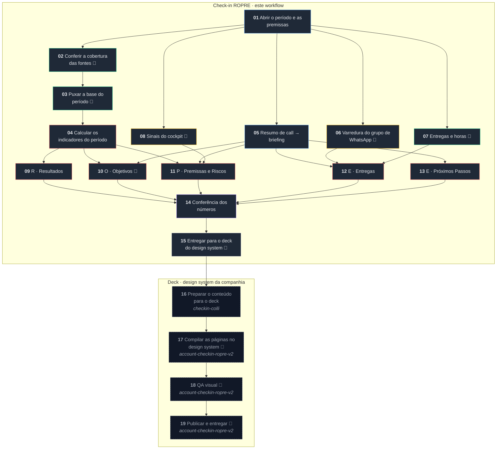

<!-- Gerado por workflow/render_spec.py a partir de workflow/checkin-ropre.workflow.json.
     Edite o JSON, não este arquivo. -->

# Check-in ROPRE — especificação do workflow para o V4OS

Especificação da versão que roda **dentro do V4OS**: os dados chegam pelo Nekt e as etapas
executam lá. Nenhum passo depende de script externo. O arquivo de import é
[`workflow/checkin-ropre.workflow.json`](../workflow/checkin-ropre.workflow.json).

O ETL em Python deste repositório deixa de ser motor e passa a ser **implementação de
referência**: serve para conferir se o workflow chegou aos mesmos números num período já
fechado.

**Cabeçalho**

| Campo | Valor |
| --- | --- |
| Nome | Check-in ROPRE — quinzenal e mensal |
| Produto | Assessoria Byline · Executar *(confirmar)* |
| Promessa | Um check-in ROPRE pronto para a reunião — deck e documento — com cada número rastreável à sua fonte e o que não foi medido escrito na cara. |
| Escopo | pessoal no primeiro ciclo; solicitar canonização depois de rodar em dois clientes |
| Cadências | quinzenal, mensal, quarter |
| Etapas | 19 |
| Conexões | 27 |

## Entradas do workflow

O formulário que se preenche para rodar. A etapa 01 consome tudo isso; nada é perguntado depois.

| Entrada | Tipo | Obrigatória | O que é |
| --- | --- | --- | --- |
| `projeto` | texto | sim | o projectDocumentId do projeto na plataforma, ou o nome do cliente — a etapa 01 resolve o id com localize_project (BigQuery de calls) ou cockpit_list_projects. Um cliente pode ter mais de um projeto (assessoria e produto adicional são contratos separados); cada projeto é um check-in. |
| `cadencia` | `quinzenal` · `mensal` · `quarter` | sim | define o corte do período e a profundidade dos blocos (ver referencias/ropre.md). |
| `referencia` | data YYYY-MM-DD | sim | qualquer dia dentro do período; a etapa 01 resolve início e fim, e marca como parcial se o período ainda não terminou. |
| `premissas_do_projeto` | objeto | sim | o que não mora em sistema nenhum da plataforma e por isso entra como input: fee, verba de mídia bruta e imposto, margem de contribuição (com origem e data), funis de venda, funil de recorrência, a regra de atribuição (tags, origens da agência, origens de mídia paga, origens em aberto, e a data em que foi fechada), os OKRs do ciclo (kr, métrica, meta, comparador), os riscos cadastrados (causa, risco, efeito, probabilidade, impacto) e, se o cliente lança à mão, o lançamento manual por mês. Molde: clientes/exemplo/cliente.json. |
| `fonte_por_canal` | objeto | não | dono de cada canal de mídia quando o mesmo canal existe em duas fontes (ex.: meta na plataforma, google numa planilha porque a conexão quebrou). Sem isso, tudo vem da plataforma e nada é contado duas vezes. |
| `grupo_de_whatsapp` | texto | não | id do grupo do cliente no BigQuery de WhatsApp. Sem ele, a etapa 06 diz que não há grupo ligado. |
| `entregas_do_periodo` | objeto | não | realizadas (com evidência), previstas (com dono e prazo) e horas, enquanto a fonte de entregas (ekyte) não estiver ligada. Molde: clientes/exemplo/entradas/entregas.json. |

## Saídas do workflow

| Saída | Sai da etapa | Formato |
| --- | --- | --- |
| **check-in aprovado** | 15 | JSON com os cinco blocos, os números, a regra de atribuição e a lista do que não foi medido. Molde real, gerado da fixture sintética: referencias/checkin.exemplo.json. É o que a etapa 16 recebe. |
| **documento de revisão** | 15 | markdown na ordem dos blocos, com as tabelas completas e a página de fontes — para conferir antes da reunião e registrar depois. |
| **deck publicado** | 19 (account-checkin-ropre-v2) | HTML 1600×900 no design system da companhia, com os mesmos números do check-in aprovado. |

## O desenho



🔧 = etapa que chama ferramenta (MCP) durante a execução.

## Como levar para o V4OS

Este arquivo é a especificação neutra do workflow, não o export do Studio. Quem constrói lá dentro — o harness ou uma pessoa — cria uma etapa por item de `etapas` e uma conexão por item de `conexoes`, seguindo os passos abaixo. Quando houver um workflow exportado do Studio para servir de molde, o mapeamento vira mecânico.

1. Declare `entradas_do_workflow` como o formulário do workflow. A etapa 01 as consome; nada é perguntado ao usuário depois.
2. O briefing de cada etapa é `briefing` **precedido do texto das leis** listadas em `leis_aplicaveis` (índices em `leis`, a partir de 1). Regra escrita fora do briefing não chega ao agente que executa a etapa.
3. Para cada etapa com `chama_ferramenta`, ligue as ferramentas de `ferramentas` (servidor e nome). Os `cuidados` de cada ferramenta entram no briefing da etapa — são as pegadinhas que já custaram número errado.
4. Etapa com `origem: catalogo` usa o template do catálogo em `etapa_do_catalogo`; o `briefing` é o complemento ao template.
5. Etapa com `origem: outra_skill` não é criada aqui: é a etapa correspondente da skill em `executado_por`, e o `briefing` é o contrato que o check-in cobra dela.
6. Ligue as `conexoes` (de → para). Etapas com o mesmo antecessor correm em paralelo.
7. Antes de publicar, rode num período já fechado e compare com a implementação de referência, número a número (seção *Como validar*).

---

## As leis do workflow

Entram no briefing de **toda** etapa que toca número — a coluna *Leis* de cada etapa diz quais.
Com o cálculo acontecendo em etapa de modelo, a regra precisa viajar junto com a tarefa — o
agente não pode depender de lembrar.

1. **Cobertura antes de conta.** Nenhum indicador que dependa de uma fonte é calculado antes de a etapa 02 dizer que aquela fonte cobre o período inteiro. Fonte incompleta → o indicador sai **"não medido"**, com o motivo e o último dia com dado.
2. **Definição é fixa, não é escolha.** Faturamento lê **data de fechamento**. Safra lê **data de criação**. Recorrente é o **funil de recorrência**, não o campo de venda base. Atribuição é a **regra declarada no projeto**, e ela aparece escrita no deck.
3. **Lacuna é resposta.** Nunca preencher buraco com média, proporção, estimativa ou "mês anterior". Não medir e dar zero são coisas diferentes, e as duas são diferentes de "estável".
4. **Número novo não nasce na escrita.** Todo valor citado nos blocos tem de existir na saída da etapa de cálculo. Quem escreve o bloco não recalcula nada.

---

## As ferramentas, por etapa

As etapas 02, 03, 06, 07, 08, 10, 15 chamam ferramenta. Servidor, nome e parâmetros de cada uma,
com os cuidados que já custaram número errado — eles entram no briefing da etapa.

| Etapa | Servidor | Ferramenta | Para quê |
| --- | --- | --- | --- |
| 02 | **dados-flow** | `flow_project_data_list_connections` | lista as conexões do projeto com categoria, plataforma, accountId, active, queryable, lastRunAt e lastRunStatus — é o estado de cada fonte |
| 02 | **dados-flow** | `flow_media_query` | último dia com custo por canal: `SELECT MAX(date_start) FROM <tabela de insights> WHERE account_id = '<id>'` |
| 02 | **dados-flow** | `flow_crm_query` | último negócio criado e atualizado, quando o CRM do projeto está na plataforma |
| 03 | **dados-flow** | `flow_media_list_tables` | descobre a tabela de insights da conexão — o nome muda por conta e por plataforma |
| 03 | **dados-flow** | `flow_media_query` | custo, impressões e cliques por dia, numa chamada só e exata |
| 03 | **dados-flow** | `flow_media_conversion_summary` | leads por dia — desempacota as ações (`lead` ou `onsite_conversion.lead_grouped`) |
| 03 | **dados-flow** | `flow_crm_list_tables + flow_crm_query` | negócios (id, criação, fechamento, status, valor, funil, etapa, motivo de perda, contato, tags, origem) e contatos (id, criação, origem, canal), quando o CRM está na plataforma |
| 05 | **bigquery-calls** | `consultar_calls_por_tipo` | as calls do projeto no período, com trecho de transcrição |
| 05 | **bigquery-calls** | `localize_project` | acha o projectDocumentId pelo nome do cliente |
| 06 | **bigquery-whatsapp** | `whatsapp_resumir_grupos_queryon` | resumo do grupo no período: `latest_resumo`, `latest_status_risco`, `last_created_at` |
| 07 | **ekyte** | a confirmar | entregas realizadas, previstas e horas do projeto |
| 08 | **cockpit** | `cockpit_list_projects` | cadastro do projeto (filtro por `filtersJson`): datas, status, contrato |
| 10 | **dados-flow** | `flow_goals_list` | metas cadastradas do período, com `target`, `actual`, `attainment` e `pace` |
| 15 | **plataforma** | a confirmar | entregar o pacote aprovado à etapa 16 (`checkin-colli`) e gravar o documento de revisão |

---

## 01 · Abrir o período e as premissas

**Categoria:** Briefing · do zero
**Entradas:** cliente, cadência (`quinzenal` | `mensal` | `quarter`), data de referência
**Saídas:** período resolvido, premissas do projeto, regra de atribuição
**Leis que entram neste briefing:** 2

> Resolva o período: quinzena fecha em 15 ou no último dia do mês; mês fecha no último dia; quarter
> fecha no trimestre. Período que ainda não terminou sai marcado **parcial**, com a data de corte.
>
> Traga do cadastro do projeto: fee, verba de mídia contratada (bruta e líquida, com o imposto),
> margem de contribuição, funis de venda, funil de recorrência e a **regra de atribuição** com a data
> em que foi fechada.
>
> Premissa sem data de confirmação sai sinalizada. Margem e regra de atribuição são as duas que mais
> mudam veredito — se estiverem "a confirmar", isso precisa aparecer no bloco de Premissas.

## 02 · Conferir a cobertura das fontes

**Categoria:** Dados · do zero · *chama ferramenta*
**Entradas:** período (01)
**Saídas:** mapa de cobertura por fonte e por canal: último dia com dado, completa sim/não
**Leis que entram neste briefing:** 1

> **Esta etapa roda antes de qualquer número.** Para cada fonte que o check-in vai usar — CRM, cada
> canal de mídia, analytics, chat — descubra o último dia com dado dentro do período e responda se
> ela cobre o período inteiro. Tolere um dia de atraso: plataforma de anúncio consolida em D-1.
>
> Quando um canal tiver custo mas não tiver contagem de lead, registre isso separadamente: custo e
> lead têm coberturas diferentes, e um lead parcial estraga CPL e taxa de entrada no CRM sem estragar
> o ROAS.
>
> Devolva a lista de fontes incompletas com nome e último dia. **Ela é insumo obrigatório da etapa de
> cálculo** e vai impressa na última página do deck.
>
> Exemplo do que isso evita, de um caso real: com a base de um canal parada, setembro rendeu ROAS de
> 37 e taxa de entrada no CRM de 720%. Os dois números eram aritmeticamente corretos e completamente
> falsos.

**Ferramentas**

- **dados-flow** · `flow_project_data_list_connections` — lista as conexões do projeto com categoria, plataforma, accountId, active, queryable, lastRunAt e lastRunStatus — é o estado de cada fonte
  Parâmetros: `{projectDocumentId}`
  - conexão com `queryable` ou `active` falso, ou `lastRunStatus` de falha, reprova o canal inteiro: registre a plataforma e o `lastRunAt` como último dia com dado.
  - no primeiro cliente o Google Ads estava falhando havia mais de dois meses e o Meta em dia; a planilha do cliente estava no inverso exato. É por isso que existe `fonte_por_canal`.
- **dados-flow** · `flow_media_query` — último dia com custo por canal: `SELECT MAX(date_start) FROM <tabela de insights> WHERE account_id = '<id>'`
  Parâmetros: `{projectDocumentId, platform, sql}`
  - mesmas regras de SQL da etapa 03.
  - tolere um dia de atraso: plataforma de anúncio consolida em D-1.
- **dados-flow** · `flow_crm_query` — último negócio criado e atualizado, quando o CRM do projeto está na plataforma
  Parâmetros: `{projectDocumentId, sql}`
  - CRM fora da plataforma: a cobertura vem do adaptador direto (implementação de referência: extrair/crm_nectarcrm.py).

## 03 · Puxar a base do período

**Categoria:** Dados · do zero · *chama ferramenta*
**Entradas:** período (01), mapa de cobertura (02)
**Saídas:** base bruta do período — negócios, contatos, mídia por dia e canal
**Leis que entram neste briefing:** 1, 2

> Puxe da plataforma de dados (servidor `dados-flow`, que o Nekt alimenta), para o período **e para os doze meses anteriores** (a série mensal e a safra precisam
> do histórico):
>
> - **negócios**: id, data de criação, data de fechamento, status, valor, funil, etapa, motivo de
>   perda, contato, e as marcas de atribuição (tag e origem);
> - **contatos**: id, data de criação, origem, canal;
> - **mídia**: um registro por dia e canal, com investimento, impressões, cliques e leads.
>
> Não agregue nada aqui e não descarte linha. Só puxe do canal que o projeto declara como fonte
> daquele canal — quando o mesmo canal existe em duas fontes, contar as duas dobra o investimento.

**Ferramentas**

- **dados-flow** · `flow_media_list_tables` — descobre a tabela de insights da conexão — o nome muda por conta e por plataforma
  Parâmetros: `{projectDocumentId, platform}`
  - prefira o stream `adsinsights`, `insights`, `ad_performance_report` ou `campaign_insights`, nessa ordem, e use `qualifiedTable`.
- **dados-flow** · `flow_media_query` — custo, impressões e cliques por dia, numa chamada só e exata
  Parâmetros: `{projectDocumentId, platform, sql}`
  ```sql
  SELECT date_start AS dia, ROUND(SUM(CAST(spend AS FLOAT64)),2) AS investimento, SUM(CAST(impressions AS INT64)) AS impressoes, SUM(CAST(clicks AS INT64)) AS cliques FROM <tabela> WHERE account_id = '<id sem act_>' AND date_start >= '<de>' AND date_start <= '<ate>' GROUP BY dia ORDER BY dia
  ```
  - `WHERE account_id = '...'` é obrigatório, com aspas simples e **sem o prefixo `act_`**.
  - `UNNEST` é bloqueado — por isso lead não sai por SQL.
  - `spend`, `impressions` e `clicks` chegam como texto: `CAST` antes de somar.
  - puxe também os doze meses anteriores: safra e série mensal precisam do histórico.
- **dados-flow** · `flow_media_conversion_summary` — leads por dia — desempacota as ações (`lead` ou `onsite_conversion.lead_grouped`)
  Parâmetros: `{projectDocumentId, platform, period: {startGte, endLt}, pagination: {page, pageSize}}`
  - `endLt` é exclusivo: passe o dia seguinte ao fim do período.
  - devolve linha por anúncio e por dia, **no máximo 100 por página e sem metadado de paginação** — pedir 500 trunca em silêncio. Foi assim que uma leitura saiu quatro vezes menor que o custo real.
  - pagine de 100 em 100 com teto (12 páginas). Se bater no teto, **descarte a contagem de lead e avise**: subcontagem é pior que lacuna. Custo continua exato, pelo SQL.
- **dados-flow** · `flow_crm_list_tables + flow_crm_query` — negócios (id, criação, fechamento, status, valor, funil, etapa, motivo de perda, contato, tags, origem) e contatos (id, criação, origem, canal), quando o CRM está na plataforma
  Parâmetros: `{projectDocumentId} para listar; {projectDocumentId, sql} para consultar`
  - sem conexão de CRM, a base vem do adaptador direto do CRM. Pegadinhas do primeiro CRM real estão no topo de extrair/crm_nectarcrm.py: filtro de status é obrigatório, o filtro de data da API não filtra, e "Ganha" em funil de qualificação não é venda.

## 04 · Calcular os indicadores do período

**Categoria:** Análise · do zero
**Entradas:** base (03), cobertura (02), premissas (01)
**Saídas:** pacote de números do período, com o período anterior ao lado
**Leis que entram neste briefing:** 1, 2, 3

> Calcule, aplicando a regra de atribuição do projeto a cada negócio e a cada contato. O que depender
> de fonte incompleta sai `null`, nunca zero.
>
> **Vendas e receita** — negócios com status ganho, em funil de venda, **data de fechamento dentro do
> período** e valor maior que zero. Separe em **novos** (demais funis) e **recorrentes** (funil de
> recorrência), com contagem, receita e ticket de cada um, e a soma dos dois.
>
> **Mídia** — investimento, impressões, cliques e leads somados do período. `CTR = cliques ÷
> impressões`. `CPL = investimento ÷ leads`. `ROAS = receita ÷ investimento`. `CAC = investimento ÷
> vendas novas`. Todos `null` se a cobertura de 02 reprovou a fonte.
>
> **Entrada no CRM** — `contatos criados no período ÷ leads das plataformas`. Se a contagem de lead
> estiver parcial, sai `null`: uma razão com numerador cheio e denominador pela metade vira 720%.
>
> **Economia do período** — `break-even mensal = (fee + verba bruta) ÷ margem`. A meta do período é o
> break-even multiplicado por `dias do período ÷ dias do mês`. `atingimento = receita ÷ meta`.
> `resultado = receita × margem − fee proporcional − mídia bruta gasta`. Se o gasto não foi medido,
> use a verba contratada proporcional **e marque que usou estimativa**.
>
> **Safra por mês de criação** — negócios criados no mês, quantos já resolvidos (ganho ou perdido),
> quantos ganhos, receita, `taxa de ganho = ganhos ÷ resolvidos` e `eficiência = receita da safra ÷
> gasto do mês`. Safra pouco resolvida não se compara com safra madura; registre a maturidade.
>
> **Série mensal** — doze meses por data de fechamento, com novos e recorrentes separados.
>
> **Cobertura de atribuição** — quantas vendas do período por tipo de marca (tag e origem, só tag, só
> origem, sem marca nenhuma). É esta tabela que sustenta o número quando o cliente diverge.
>
> **Ponte com o lançamento do cliente** — quando o cliente mantém planilha própria, compare mês a mês
> o que ele lança com o que o CRM mostra, separando venda nova de recompra. A divergência quase sempre
> é recompra: a planilha lança só a venda nova e a recompra fica numa linha à parte.
>
> Repita tudo para o **período anterior de mesmo tamanho** e devolva a variação de cada indicador.

## 05 · Resumo de call → briefing

**Categoria:** Briefing · **do catálogo** (`Resumo de call → briefing`)
**Entradas:** transcrições das calls do período
**Saídas:** acordos, pendências e riscos, com data
**Leis que entram neste briefing:** nenhuma

> Além do que o template do catálogo já faz, separe a saída em três listas: **acordos** (o que ficou
> combinado e quem assumiu), **pendências** (o que ficou aberto e de quem é a bola) e **riscos**
> (ameaça ao resultado levantada na conversa).
>
> Só entra o que foi dito. Não infira compromisso a partir de tom, de silêncio ou de "a gente vê
> isso". Sem call no período, devolva as três listas vazias e diga que não houve.

**Ferramentas**

- **bigquery-calls** · `consultar_calls_por_tipo` — as calls do projeto no período, com trecho de transcrição
  Parâmetros: `{project_document_id, start_date, end_date, mode: "list", limit: "50", include_transcription_excerpt: "true", demais filtros como string vazia}`
  - todos os parâmetros são string, inclusive `limit` e os booleanos.
  - `transcription_excerpt` é um trecho; para a transcrição inteira, confirmar a ferramenta.
  - no primeiro cliente voltou vazio no período — confirmar onde as calls daquele projeto ficam registradas. Sem call, as três listas saem vazias e o bloco diz que não houve.
  - esta etapa é do catálogo: se o template não buscar a transcrição sozinho, a busca entra como etapa de dados antes dela.
- **bigquery-calls** · `localize_project` — acha o projectDocumentId pelo nome do cliente
  Parâmetros: `{search_text}`

## 06 · Varredura do grupo de WhatsApp

**Categoria:** Pesquisa · do zero · *chama ferramenta*
**Entradas:** período (01), grupo do cliente
**Saídas:** pendências abertas com data e o que trava
**Leis que entram neste briefing:** nenhuma

> Traga só o que virou pendência: aprovação que não veio, material que o cliente ficou de mandar,
> acesso que falta, reclamação sem resposta. Conversa resolvida no próprio dia não entra.
>
> Cada linha precisa de data e de uma frase acionável — ela vai direto para o bloco de Entregas.
> Se os campos de resumo do grupo vierem vazios, diga isso: é problema de operação e vira risco.

**Ferramentas**

- **bigquery-whatsapp** · `whatsapp_resumir_grupos_queryon` — resumo do grupo no período: `latest_resumo`, `latest_status_risco`, `last_created_at`
  Parâmetros: `{id_group, start_date, end_date, mode: "list", limit: "50", client_documentid: "", search_name: ""}`
  - parâmetros são string.
  - os campos de resumo podem vir vazios com o grupo ativo — no primeiro cliente vieram. Isso é aviso de operação (vira risco no bloco P), não é zero pendência.

## 07 · Entregas e horas

**Categoria:** Dados · do zero · *chama ferramenta*
**Entradas:** período (01), projeto no ekyte
**Saídas:** entregas realizadas, previstas e horas dedicadas
**Leis que entram neste briefing:** 3

> Traga o que a equipe entregou no período, o que está previsto e as horas dedicadas.
>
> **Entrega sem evidência não entra**: cada item aponta para algo que o cliente possa conferir — a
> peça no ar, o documento, a campanha publicada. Tarefa interna de alinhamento não é entrega de
> cliente. Previsto sem dono ou sem data sai marcado `a confirmar`.

**Ferramentas**

- **ekyte** · a confirmar — entregas realizadas, previstas e horas do projeto
  Parâmetros: `a confirmar`
  - o servidor veio sem credencial na configuração recebida. Até ligar, as entregas entram pela entrada `entregas_do_periodo` do workflow, e a etapa diz de onde vieram.

## 08 · Sinais do cockpit

**Categoria:** Pesquisa · do zero · *chama ferramenta*
**Entradas:** projeto
**Saídas:** health score e variação, churn ou renovação no horizonte, NPS recente
**Leis que entram neste briefing:** nenhuma

> Health score não é resultado do trabalho: é termômetro de relação, e entra como **contexto de
> risco**. Health caindo num período de resultado subindo é exatamente o que a reunião precisa saber.

**Ferramentas**

- **cockpit** · `cockpit_list_projects` — cadastro do projeto (filtro por `filtersJson`): datas, status, contrato
  Parâmetros: `{filtersJson}`
  - as ferramentas de health score, NPS e churn do cockpit não foram confirmadas; a implementação de referência não as chama. Sem elas, a etapa diz que não há sinal — não inventa health.

## 09 · R · Resultados

**Categoria:** Análise · do zero
**Entradas:** pacote de números (04), cobertura (02)
**Saídas:** bloco R escrito
**Leis que entram neste briefing:** 2, 3, 4

> Abra com a frase que responde o período: quantas vendas, quanta receita, quanto da meta, e como
> ficou contra o período anterior. Depois, obrigatoriamente:
>
> - **novo contra recorrente**, separados e somados;
> - **a ponte com o lançamento do cliente**, que explica a divergência antes de ele perguntar;
> - **como as vendas estão marcadas**, com a regra de atribuição escrita por extenso e datada;
> - **eficiência por safra**, que isola o efeito da mídia do mês.
>
> Indicador `null` vira "não medido" com o motivo ao lado. Não escreva "estável" nem "sem variação
> relevante" no lugar de ausência de medição. Não invente número que não esteja no pacote.

## 10 · O · Objetivos

**Categoria:** Análise · do zero · *chama ferramenta*
**Entradas:** pacote (04), acordos da call (05), metas cadastradas
**Saídas:** bloco O
**Leis que entram neste briefing:** 3, 4

> Puxe as metas do período. Sem meta cadastrada, use as do cadastro do projeto **e diga que a meta não
> está no sistema** — cadastrar vira próximo passo.
>
> Cada key result sai com meta, realizado e status: ✅ atingido, ⏳ dentro da tolerância, ❌ fora,
> — sem dado. KR cujo indicador ficou sem medição sai como — e **não** como ❌: não atingir e não
> medir são coisas diferentes.
>
> Feche com o que foi acordado com o cliente nas calls do período.

**Ferramentas**

- **dados-flow** · `flow_goals_list` — metas cadastradas do período, com `target`, `actual`, `attainment` e `pace`
  Parâmetros: `{subjectRef: <projectDocumentId>, subjectType: "project", periodKey: "YYYY-MM", granularity: "monthly"}`
  - `granularity` é `monthly`, não `month`.
  - sem item, o projeto está sem meta cadastrada no período: use os OKRs das premissas e **diga que a meta não está no sistema** — cadastrar vira próximo passo.

## 11 · P · Premissas e Riscos

**Categoria:** Análise · do zero
**Entradas:** premissas (01), riscos da call (05), cockpit (08), cobertura (02), pacote (04)
**Saídas:** bloco P
**Leis que entram neste briefing:** 3, 4

> **Premissas:** o que o check-in assume como verdade — margem, verba, regra de atribuição, escopo —
> cada uma com a origem ("confirmada com o cliente em DD/MM", "contrato", "a confirmar"). Premissa sem
> origem é risco disfarçado.
>
> **Riscos** no formato causa → risco → efeito, com probabilidade e impacto de 1 a 5 e o produto.
> Quatro fontes: os riscos cadastrados, os levantados na call, os sinais do cockpit e **os que o
> próprio dado denuncia** — base parada, entrada no CRM abaixo de 80%, receita majoritariamente sem
> canal identificado, evento de conversão sem disparar. Risco vindo do dado não precisa de P × I
> inventado: deixe em branco e mostre o número que o gerou.

## 12 · E · Entregas

**Categoria:** Análise · do zero
**Entradas:** ekyte (07), WhatsApp (06), call (05)
**Saídas:** bloco de Entregas
**Leis que entram neste briefing:** 3, 4

> Três listas e um número: realizadas com evidência, previstas com prazo e dono (`a confirmar` quando
> faltar), pendências abertas juntando WhatsApp e call, e as horas dedicadas. Sem as horas na fonte,
> diga que não tem — não estime somando tarefa.

## 13 · E · Próximos Passos

**Categoria:** Análise · do zero
**Entradas:** acordos (05), riscos (11), backlog
**Saídas:** bloco de Próximos Passos
**Leis que entram neste briefing:** 4

> O que vem, com dono e prazo, de duas origens: o acordado com o cliente e o planejado pela equipe.
>
> Todo passo responde ao que o check-in mostrou. Se o bloco R apontou queda de aquisição e o bloco P
> pôs o atendimento como maior P × I, o primeiro passo é sobre isso — não sobre o que estava no
> backlog antes da reunião. Passo sem dono sai `a confirmar`, visível no deck.

## 14 · Conferência dos números

**Categoria:** Revisão · do zero
**Entradas:** blocos (09 a 13), pacote (04), base (03), cobertura (02)
**Saídas:** aprovado, ou lista de correções que impede seguir
**Leis que entram neste briefing:** 1, 2, 3, 4

> Esta etapa existe porque o cálculo foi feito por agente. Confira seis coisas e **bloqueie** se
> qualquer uma falhar:
>
> 1. **recontagem independente**: some de novo, direto da base da etapa 03, a receita e a contagem de
>    vendas do período. Tem de bater com o pacote até o centavo;
> 2. **fechamento das partes**: novos + recorrentes = total, em contagem e em receita;
> 3. **nenhum número novo** nos blocos que não exista no pacote;
> 4. **nada marcado "não medido" virou número** em algum bloco;
> 5. **período parcial marcado** em toda comparação, com meta proporcional;
> 6. **regra de atribuição escrita** no bloco R, com a data em que foi fechada.
>
> Divergência entre a recontagem e o pacote é erro de cálculo, não arredondamento: devolva os dois
> números e pare. Check-in atrasado custa menos que check-in com número que não fecha.

## 15 · Entregar para o deck do design system

**Categoria:** Entrega · do zero · *chama ferramenta*
**Entradas:** check-in aprovado (14)
**Saídas:** check-in em formato de consumo para a skill de deck, documento de revisão
**Leis que entram neste briefing:** 3, 4

> **Este workflow não desenha slide.** O deck é responsabilidade da skill de design system da
> companhia (`account-checkin-ropre-v2`), que já tem os tokens visuais, os layouts de 1600×900, o
> storytelling de performance e o QA visual. O que sai daqui é o conteúdo aprovado, pronto para ela
> consumir.
>
> Entregue dois artefatos do mesmo pacote:
>
> 1. **o check-in aprovado**, com os cinco blocos, os números e a lista do que não foi medido, no
>    formato que a skill de deck espera;
> 2. **o documento de revisão**, para conferência antes da reunião e registro depois.
>
> Dois conteúdos são obrigatórios e não podem ser podados pela diagramação: a **regra de atribuição**
> escrita por extenso no bloco de Resultados, e a página final de **fontes e o que não foi medido**.
> Se o layout não tiver lugar para elas, o lugar tem de ser criado — são elas que permitem defender o
> número linha por linha na reunião.
>
> Fora da plataforma, quando não há design system disponível, o renderizador local gera um .pptx na
> mesma ordem de blocos. É fallback, não é o caminho principal.

**Ferramentas**

- **plataforma** · a confirmar — entregar o pacote aprovado à etapa 16 (`checkin-colli`) e gravar o documento de revisão
  Parâmetros: `o pacote de referencias/checkin.exemplo.json`
  - como uma etapa aciona outra skill no V4OS está em aberto — é a pendência que decide se o handoff é automático ou manual.

## 16 · Preparar o conteúdo para o deck

**Categoria:** Entrega · **outra skill** · executada por `checkin-colli`
**Entradas:** check-in aprovado (15)
**Saídas:** conteúdo do deck organizado em narrativa de slides
**Leis que entram neste briefing:** 3, 4

> Executada por `checkin-colli`. Transforma os cinco blocos do ROPRE na narrativa que o deck vai
> contar: uma ideia por slide, na ordem capa → índice → 01 Resultados → 02 Objetivos → 03 Premissas e
> Riscos → 04 Entregas → 05 Próximos Passos → fontes.
>
> O que o check-in exige desta etapa, e que vale como contrato: **nenhum número pode ser recalculado,
> arredondado ou reescrito aqui**. Indicador que chegou como "não medido" continua "não medido" —
> não vira travessão, não vira zero e não é omitido por não caber no slide.

## 17 · Compilar as páginas no design system

**Categoria:** Entrega · **outra skill** · *chama ferramenta* · executada por `account-checkin-ropre-v2`
**Entradas:** conteúdo do deck (16)
**Saídas:** deck HTML 1600×900 com os tokens da marca aplicados
**Leis que entram neste briefing:** 4

> Executada por `account-checkin-ropre-v2`. Compila as páginas: escolhe o layout de cada slide pelo
> tipo de conteúdo (KPI, tabela, gráfico, lista, divisória), aplica os tokens visuais e monta o deck
> em HTML 1600×900.
>
> Dois conteúdos são **requisito de layout**, não preferência editorial, e precisam de lugar previsto:
> a **regra de atribuição escrita por extenso** no bloco de Resultados, e a **página final de fontes e
> do que não foi medido**. São elas que permitem defender o número linha por linha na reunião; slide
> que as corta devolve o check-in para esta etapa.

**Ferramentas**

- **account-checkin-ropre-v2** · internas da skill — compilar as páginas com os tokens do design system
  Parâmetros: `conteúdo do deck (16)`

## 18 · QA visual

**Categoria:** Revisão · **outra skill** · *chama ferramenta* · executada por `account-checkin-ropre-v2`
**Entradas:** deck compilado (17), check-in aprovado (15)
**Saídas:** deck aprovado ou lista de correções de layout
**Leis que entram neste briefing:** 3, 4

> Executada por `account-checkin-ropre-v2`. Confere o deck contra o conteúdo que entrou: texto
> cortado, tabela estourando a página, contraste, consistência de tokens e slide vazio.
>
> Acrescente duas conferências de conteúdo, que são as que interessam ao check-in: **todo número do
> deck existe no check-in aprovado** e **nenhum "não medido" virou número na diagramação**.
> Divergência aqui não é ajuste de layout — é erro, e volta para a etapa 16.

**Ferramentas**

- **account-checkin-ropre-v2** · internas da skill — QA visual e as duas conferências de conteúdo
  Parâmetros: `deck compilado (17) e check-in aprovado (15)`

## 19 · Publicar e entregar

**Categoria:** Entrega · **outra skill** · *chama ferramenta* · executada por `account-checkin-ropre-v2`
**Entradas:** deck aprovado (18), documento de revisão (15)
**Saídas:** deck publicado para a reunião, documento de registro
**Leis que entram neste briefing:** 4

> Executada por `account-checkin-ropre-v2`. Publica o deck para a reunião e guarda o documento de
> revisão como registro do período.
>
> O documento não é rascunho do deck: é onde o check-in fica auditável depois, com as tabelas
> completas e a lista de fontes. Deck e documento saem do mesmo pacote e não podem mostrar números
> diferentes.

**Ferramentas**

- **account-checkin-ropre-v2** · internas da skill — publicar o deck e guardar o documento
  Parâmetros: `deck aprovado (18) e documento (15)`

---

## Onde este workflow encosta em outras skills

O check-in produz **conteúdo com número defensável**. Diagramação, identidade visual e QA
visual são de quem cuida do design system. A fronteira:

| Skill | Papel | Relação com este workflow | Contrato de entrada |
| --- | --- | --- | --- |
| `account-checkin-ropre-v2` | renderiza o deck no design system da companhia — HTML 1600×900, tokens visuais, layouts de slide, storytelling de performance e QA visual | recebe o check-in aprovado da etapa 15, passando pela 16; este workflow não desenha slide | a confirmar — até lá, o check-in entrega no formato de referencias/checkin.exemplo.json |
| `checkin-colli` | prepara o conteúdo antes do deck | sobrepõe em parte os blocos 09 a 13; confirmar a divisão para não haver etapa duplicada | a confirmar — até lá, recebe o formato de referencias/checkin.exemplo.json |
| `design-system-pro` | criar ou refazer o design system no Figma | fora do escopo do check-in; entra só se o design system mudar | não se aplica |

Os contratos de entrada marcados como *a confirmar* são o que falta para o encaixe ser
automático em vez de manual. Até lá, o check-in entrega no formato de
[`referencias/checkin.exemplo.json`](checkin.exemplo.json).

---

## Conexões

```
  01→02  01→05  01→06  01→07  01→08  02→03  03→04  04→09  04→10  04→11  05→10  05→11  05→12  05→13  06→12  07→12  08→11  09→14  10→14  11→14  12→14  13→14  14→15  15→16  16→17  17→18  18→19
```

## Como validar antes de publicar

Rode o workflow num **período já fechado** e compare com a implementação de referência deste
repositório, número a número: vendas, receita, novos, recorrentes, ganhos da safra e taxa de
ganho. Se o workflow chegar sozinho aos mesmos valores, as definições estão corretamente
escritas nos briefings. Se não chegar, a diferença aponta exatamente qual definição ficou
ambígua.

## O que ainda depende de quem está dentro da plataforma

| O que falta | Por quê | Quem responde |
| --- | --- | --- |
| schema de export do Studio | para o mapeamento deste JSON ser mecânico em vez de manual | V4OS |
| catálogo completo de etapas | 06, 07 e 08 podem ter template pronto; só `Resumo de call → briefing` foi reusada | V4OS |
| como uma etapa declara a ferramenta MCP que chama | vale para toda etapa marcada 🔧 | V4OS |
| como uma etapa aciona outra skill | é a passagem 15 → 16 | V4OS |
| contrato de entrada de `checkin-colli` e de `account-checkin-ropre-v2` | até saber o formato que elas esperam, o check-in entrega no de referencias/checkin.exemplo.json | dono das skills |
| servidor e credencial do ekyte | a etapa 07 está sem fonte; enquanto isso, entregas entram pela entrada `entregas_do_periodo` | V4OS |
| ferramentas de health score, NPS e churn do cockpit | etapa 08; só `cockpit_list_projects` é conhecida | V4OS |
| onde as calls do projeto ficam registradas | `consultar_calls_por_tipo` voltou vazio no primeiro cliente | V4OS |
| produto do workflow | cabeçalho está como *a confirmar* | quem publica |
