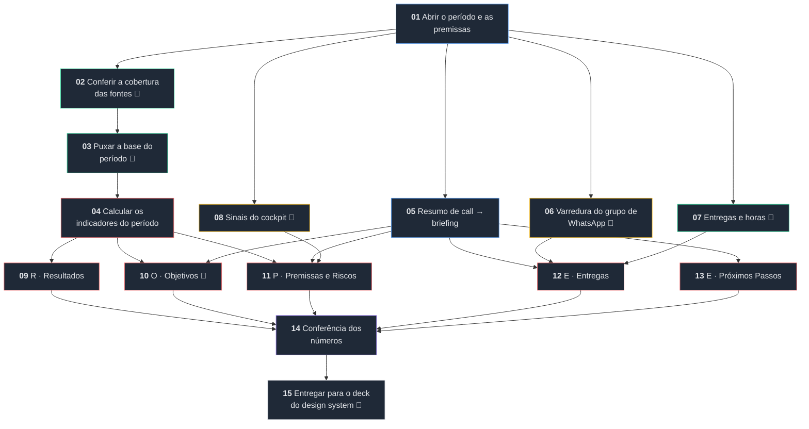

<!-- Gerado por workflow/render_spec.py a partir de workflow/checkin-ropre.workflow.json.
     Edite o JSON, não este arquivo. -->

# Check-in ROPRE — especificação do workflow para o V4S

Especificação da versão que roda **dentro do V4S**: os dados chegam pelo Nekt e as etapas
executam lá. Nenhum passo depende de script externo. O arquivo de import é
[`workflow/checkin-ropre.workflow.json`](../workflow/checkin-ropre.workflow.json).

O ETL em Python deste repositório deixa de ser motor e passa a ser **implementação de
referência**: serve para conferir se o workflow chegou aos mesmos números num período já
fechado.

**Cabeçalho**

| Campo | Valor |
| --- | --- |
| Nome | Check-in ROPRE — quinzenal e mensal |
| Produto | Assessoria Byline · Executar *(confirmar)* |
| Promessa | Um check-in ROPRE pronto para a reunião — deck e documento — com cada número rastreável à sua fonte e o que não foi medido escrito na cara. |
| Escopo | pessoal no primeiro ciclo; solicitar canonização depois de rodar em dois clientes |
| Cadências | quinzenal, mensal, quarter |
| Etapas | 15 |
| Conexões | 23 |

## O desenho



🔧 = etapa que chama ferramenta (MCP) durante a execução.

---

## As leis do workflow

Entram no briefing de **toda** etapa que toca número. Com o cálculo acontecendo em etapa de
modelo, a regra precisa viajar junto com a tarefa — o agente não pode depender de lembrar.

1. **Cobertura antes de conta.** Nenhum indicador que dependa de uma fonte é calculado antes de a etapa 02 dizer que aquela fonte cobre o período inteiro. Fonte incompleta → o indicador sai **"não medido"**, com o motivo e o último dia com dado.
2. **Definição é fixa, não é escolha.** Faturamento lê **data de fechamento**. Safra lê **data de criação**. Recorrente é o **funil de recorrência**, não o campo de venda base. Atribuição é a **regra declarada no projeto**, e ela aparece escrita no deck.
3. **Lacuna é resposta.** Nunca preencher buraco com média, proporção, estimativa ou "mês anterior". Não medir e dar zero são coisas diferentes, e as duas são diferentes de "estável".
4. **Número novo não nasce na escrita.** Todo valor citado nos blocos tem de existir na saída da etapa de cálculo. Quem escreve o bloco não recalcula nada.

---

## 01 · Abrir o período e as premissas

**Categoria:** Briefing · do zero
**Entradas:** cliente, cadência (`quinzenal` | `mensal` | `quarter`), data de referência
**Saídas:** período resolvido, premissas do projeto, regra de atribuição

> Resolva o período: quinzena fecha em 15 ou no último dia do mês; mês fecha no último dia; quarter
> fecha no trimestre. Período que ainda não terminou sai marcado **parcial**, com a data de corte.
>
> Traga do cadastro do projeto: fee, verba de mídia contratada (bruta e líquida, com o imposto),
> margem de contribuição, funis de venda, funil de recorrência e a **regra de atribuição** com a data
> em que foi fechada.
>
> Premissa sem data de confirmação sai sinalizada. Margem e regra de atribuição são as duas que mais
> mudam veredito — se estiverem "a confirmar", isso precisa aparecer no bloco de Premissas.

## 02 · Conferir a cobertura das fontes

**Categoria:** Dados · do zero · *chama ferramenta*
**Entradas:** período (01)
**Saídas:** mapa de cobertura por fonte e por canal: último dia com dado, completa sim/não

> **Esta etapa roda antes de qualquer número.** Para cada fonte que o check-in vai usar — CRM, cada
> canal de mídia, analytics, chat — descubra o último dia com dado dentro do período e responda se
> ela cobre o período inteiro. Tolere um dia de atraso: plataforma de anúncio consolida em D-1.
>
> Quando um canal tiver custo mas não tiver contagem de lead, registre isso separadamente: custo e
> lead têm coberturas diferentes, e um lead parcial estraga CPL e taxa de entrada no CRM sem estragar
> o ROAS.
>
> Devolva a lista de fontes incompletas com nome e último dia. **Ela é insumo obrigatório da etapa de
> cálculo** e vai impressa na última página do deck.
>
> Exemplo do que isso evita, de um caso real: com a base de um canal parada, setembro rendeu ROAS de
> 37 e taxa de entrada no CRM de 720%. Os dois números eram aritmeticamente corretos e completamente
> falsos.

## 03 · Puxar a base do período

**Categoria:** Dados · do zero · *chama ferramenta*
**Entradas:** período (01), mapa de cobertura (02)
**Saídas:** base bruta do período — negócios, contatos, mídia por dia e canal

> Puxe do Nekt, para o período **e para os doze meses anteriores** (a série mensal e a safra precisam
> do histórico):
>
> - **negócios**: id, data de criação, data de fechamento, status, valor, funil, etapa, motivo de
>   perda, contato, e as marcas de atribuição (tag e origem);
> - **contatos**: id, data de criação, origem, canal;
> - **mídia**: um registro por dia e canal, com investimento, impressões, cliques e leads.
>
> Não agregue nada aqui e não descarte linha. Só puxe do canal que o projeto declara como fonte
> daquele canal — quando o mesmo canal existe em duas fontes, contar as duas dobra o investimento.

## 04 · Calcular os indicadores do período

**Categoria:** Análise · do zero
**Entradas:** base (03), cobertura (02), premissas (01)
**Saídas:** pacote de números do período, com o período anterior ao lado

> Calcule, aplicando a regra de atribuição do projeto a cada negócio e a cada contato. O que depender
> de fonte incompleta sai `null`, nunca zero.
>
> **Vendas e receita** — negócios com status ganho, em funil de venda, **data de fechamento dentro do
> período** e valor maior que zero. Separe em **novos** (demais funis) e **recorrentes** (funil de
> recorrência), com contagem, receita e ticket de cada um, e a soma dos dois.
>
> **Mídia** — investimento, impressões, cliques e leads somados do período. `CTR = cliques ÷
> impressões`. `CPL = investimento ÷ leads`. `ROAS = receita ÷ investimento`. `CAC = investimento ÷
> vendas novas`. Todos `null` se a cobertura de 02 reprovou a fonte.
>
> **Entrada no CRM** — `contatos criados no período ÷ leads das plataformas`. Se a contagem de lead
> estiver parcial, sai `null`: uma razão com numerador cheio e denominador pela metade vira 720%.
>
> **Economia do período** — `break-even mensal = (fee + verba bruta) ÷ margem`. A meta do período é o
> break-even multiplicado por `dias do período ÷ dias do mês`. `atingimento = receita ÷ meta`.
> `resultado = receita × margem − fee proporcional − mídia bruta gasta`. Se o gasto não foi medido,
> use a verba contratada proporcional **e marque que usou estimativa**.
>
> **Safra por mês de criação** — negócios criados no mês, quantos já resolvidos (ganho ou perdido),
> quantos ganhos, receita, `taxa de ganho = ganhos ÷ resolvidos` e `eficiência = receita da safra ÷
> gasto do mês`. Safra pouco resolvida não se compara com safra madura; registre a maturidade.
>
> **Série mensal** — doze meses por data de fechamento, com novos e recorrentes separados.
>
> **Cobertura de atribuição** — quantas vendas do período por tipo de marca (tag e origem, só tag, só
> origem, sem marca nenhuma). É esta tabela que sustenta o número quando o cliente diverge.
>
> **Ponte com o lançamento do cliente** — quando o cliente mantém planilha própria, compare mês a mês
> o que ele lança com o que o CRM mostra, separando venda nova de recompra. A divergência quase sempre
> é recompra: a planilha lança só a venda nova e a recompra fica numa linha à parte.
>
> Repita tudo para o **período anterior de mesmo tamanho** e devolva a variação de cada indicador.

## 05 · Resumo de call → briefing

**Categoria:** Briefing · **do catálogo** (`Resumo de call → briefing`)
**Entradas:** transcrições das calls do período
**Saídas:** acordos, pendências e riscos, com data

> Além do que o template do catálogo já faz, separe a saída em três listas: **acordos** (o que ficou
> combinado e quem assumiu), **pendências** (o que ficou aberto e de quem é a bola) e **riscos**
> (ameaça ao resultado levantada na conversa).
>
> Só entra o que foi dito. Não infira compromisso a partir de tom, de silêncio ou de "a gente vê
> isso". Sem call no período, devolva as três listas vazias e diga que não houve.

## 06 · Varredura do grupo de WhatsApp

**Categoria:** Pesquisa · do zero · *chama ferramenta*
**Entradas:** período (01), grupo do cliente
**Saídas:** pendências abertas com data e o que trava

> Traga só o que virou pendência: aprovação que não veio, material que o cliente ficou de mandar,
> acesso que falta, reclamação sem resposta. Conversa resolvida no próprio dia não entra.
>
> Cada linha precisa de data e de uma frase acionável — ela vai direto para o bloco de Entregas.
> Se os campos de resumo do grupo vierem vazios, diga isso: é problema de operação e vira risco.

## 07 · Entregas e horas

**Categoria:** Dados · do zero · *chama ferramenta*
**Entradas:** período (01), projeto no ekyte
**Saídas:** entregas realizadas, previstas e horas dedicadas

> Traga o que a equipe entregou no período, o que está previsto e as horas dedicadas.
>
> **Entrega sem evidência não entra**: cada item aponta para algo que o cliente possa conferir — a
> peça no ar, o documento, a campanha publicada. Tarefa interna de alinhamento não é entrega de
> cliente. Previsto sem dono ou sem data sai marcado `a confirmar`.

## 08 · Sinais do cockpit

**Categoria:** Pesquisa · do zero · *chama ferramenta*
**Entradas:** projeto
**Saídas:** health score e variação, churn ou renovação no horizonte, NPS recente

> Health score não é resultado do trabalho: é termômetro de relação, e entra como **contexto de
> risco**. Health caindo num período de resultado subindo é exatamente o que a reunião precisa saber.

## 09 · R · Resultados

**Categoria:** Análise · do zero
**Entradas:** pacote de números (04), cobertura (02)
**Saídas:** bloco R escrito

> Abra com a frase que responde o período: quantas vendas, quanta receita, quanto da meta, e como
> ficou contra o período anterior. Depois, obrigatoriamente:
>
> - **novo contra recorrente**, separados e somados;
> - **a ponte com o lançamento do cliente**, que explica a divergência antes de ele perguntar;
> - **como as vendas estão marcadas**, com a regra de atribuição escrita por extenso e datada;
> - **eficiência por safra**, que isola o efeito da mídia do mês.
>
> Indicador `null` vira "não medido" com o motivo ao lado. Não escreva "estável" nem "sem variação
> relevante" no lugar de ausência de medição. Não invente número que não esteja no pacote.

## 10 · O · Objetivos

**Categoria:** Análise · do zero · *chama ferramenta*
**Entradas:** pacote (04), acordos da call (05), metas cadastradas
**Saídas:** bloco O

> Puxe as metas do período. Sem meta cadastrada, use as do cadastro do projeto **e diga que a meta não
> está no sistema** — cadastrar vira próximo passo.
>
> Cada key result sai com meta, realizado e status: ✅ atingido, ⏳ dentro da tolerância, ❌ fora,
> — sem dado. KR cujo indicador ficou sem medição sai como — e **não** como ❌: não atingir e não
> medir são coisas diferentes.
>
> Feche com o que foi acordado com o cliente nas calls do período.

## 11 · P · Premissas e Riscos

**Categoria:** Análise · do zero
**Entradas:** premissas (01), riscos da call (05), cockpit (08), cobertura (02), pacote (04)
**Saídas:** bloco P

> **Premissas:** o que o check-in assume como verdade — margem, verba, regra de atribuição, escopo —
> cada uma com a origem ("confirmada com o cliente em DD/MM", "contrato", "a confirmar"). Premissa sem
> origem é risco disfarçado.
>
> **Riscos** no formato causa → risco → efeito, com probabilidade e impacto de 1 a 5 e o produto.
> Quatro fontes: os riscos cadastrados, os levantados na call, os sinais do cockpit e **os que o
> próprio dado denuncia** — base parada, entrada no CRM abaixo de 80%, receita majoritariamente sem
> canal identificado, evento de conversão sem disparar. Risco vindo do dado não precisa de P × I
> inventado: deixe em branco e mostre o número que o gerou.

## 12 · E · Entregas

**Categoria:** Análise · do zero
**Entradas:** ekyte (07), WhatsApp (06), call (05)
**Saídas:** bloco de Entregas

> Três listas e um número: realizadas com evidência, previstas com prazo e dono (`a confirmar` quando
> faltar), pendências abertas juntando WhatsApp e call, e as horas dedicadas. Sem as horas na fonte,
> diga que não tem — não estime somando tarefa.

## 13 · E · Próximos Passos

**Categoria:** Análise · do zero
**Entradas:** acordos (05), riscos (11), backlog
**Saídas:** bloco de Próximos Passos

> O que vem, com dono e prazo, de duas origens: o acordado com o cliente e o planejado pela equipe.
>
> Todo passo responde ao que o check-in mostrou. Se o bloco R apontou queda de aquisição e o bloco P
> pôs o atendimento como maior P × I, o primeiro passo é sobre isso — não sobre o que estava no
> backlog antes da reunião. Passo sem dono sai `a confirmar`, visível no deck.

## 14 · Conferência dos números

**Categoria:** Revisão · do zero
**Entradas:** blocos (09 a 13), pacote (04), base (03), cobertura (02)
**Saídas:** aprovado, ou lista de correções que impede seguir

> Esta etapa existe porque o cálculo foi feito por agente. Confira seis coisas e **bloqueie** se
> qualquer uma falhar:
>
> 1. **recontagem independente**: some de novo, direto da base da etapa 03, a receita e a contagem de
>    vendas do período. Tem de bater com o pacote até o centavo;
> 2. **fechamento das partes**: novos + recorrentes = total, em contagem e em receita;
> 3. **nenhum número novo** nos blocos que não exista no pacote;
> 4. **nada marcado "não medido" virou número** em algum bloco;
> 5. **período parcial marcado** em toda comparação, com meta proporcional;
> 6. **regra de atribuição escrita** no bloco R, com a data em que foi fechada.
>
> Divergência entre a recontagem e o pacote é erro de cálculo, não arredondamento: devolva os dois
> números e pare. Check-in atrasado custa menos que check-in com número que não fecha.

## 15 · Entregar para o deck do design system

**Categoria:** Entrega · do zero · *chama ferramenta*
**Entradas:** check-in aprovado (14)
**Saídas:** check-in em formato de consumo para a skill de deck, documento de revisão

> **Este workflow não desenha slide.** O deck é responsabilidade da skill de design system da
> companhia (`account-checkin-ropre-v2`), que já tem os tokens visuais, os layouts de 1600×900, o
> storytelling de performance e o QA visual. O que sai daqui é o conteúdo aprovado, pronto para ela
> consumir.
>
> Entregue dois artefatos do mesmo pacote:
>
> 1. **o check-in aprovado**, com os cinco blocos, os números e a lista do que não foi medido, no
>    formato que a skill de deck espera;
> 2. **o documento de revisão**, para conferência antes da reunião e registro depois.
>
> Dois conteúdos são obrigatórios e não podem ser podados pela diagramação: a **regra de atribuição**
> escrita por extenso no bloco de Resultados, e a página final de **fontes e o que não foi medido**.
> Se o layout não tiver lugar para elas, o lugar tem de ser criado — são elas que permitem defender o
> número linha por linha na reunião.
>
> Fora da plataforma, quando não há design system disponível, o renderizador local gera um .pptx na
> mesma ordem de blocos. É fallback, não é o caminho principal.

---

## Onde este workflow encosta em outras skills

O check-in produz **conteúdo com número defensável**. Diagramação, identidade visual e QA
visual são de quem cuida do design system. A fronteira:

| Skill | Papel | Relação com este workflow |
| --- | --- | --- |
| `account-checkin-ropre-v2` | renderiza o deck no design system da companhia — HTML 1600×900, tokens visuais, layouts de slide, storytelling de performance e QA visual | recebe o check-in aprovado (etapa 14) e produz o deck; este workflow não desenha slide |
| `checkin-colli` | prepara o conteúdo antes do deck | sobrepõe em parte os blocos 09 a 13; confirmar a divisão para não haver etapa duplicada |
| `design-system-pro` | criar ou refazer o design system no Figma | fora do escopo do check-in; entra só se o design system mudar |

Os contratos de entrada marcados como *a confirmar* são o que falta para o encaixe ser
automático em vez de manual.

---

## Conexões

```
  01→02  01→05  01→06  01→07  01→08  02→03  03→04  04→09  04→10  04→11  05→10  05→11  05→12  05→13  06→12  07→12  08→11  09→14  10→14  11→14  12→14  13→14  14→15
```

## Como validar antes de publicar

Rode o workflow num **período já fechado** e compare com a implementação de referência deste
repositório, número a número: vendas, receita, novos, recorrentes, ganhos da safra e taxa de
ganho. Se o workflow chegar sozinho aos mesmos valores, as definições estão corretamente
escritas nos briefings. Se não chegar, a diferença aponta exatamente qual definição ficou
ambígua.

## O que ainda depende do Studio

1. **O schema de import do V4S.** O JSON deste repositório é neutro e auto-descritivo; o
   mapeamento para o formato do Studio é mecânico assim que houver um workflow exportado de lá
   para servir de molde.
2. **O catálogo completo de etapas.** Só uma etapa foi reusada (`Resumo de call → briefing`);
   com a lista inteira, provavelmente 06, 07 e 08 também têm equivalente pronto.
3. **Como a etapa declara a ferramenta que chama** — vale para as sete etapas marcadas com 🔧.
4. **Confirmar o produto** do workflow.
